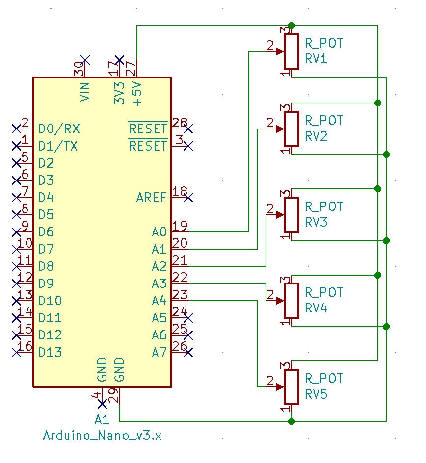

# Triple Cripple Uncripplers

A team of Sec 4s from the **School of Science and Technology, Singapore**.

## Instructions

### Glove

1. For each hand, print:

   1. 5 [End caps](hardware/stl/Prot3_EndCap.STL)[^endcap]
   2. 14 [Guide nodes](hardware/stl/Prot3_EndCap.STL)[^nodes]
   3. 5 [Holders](hardware/stl/Prot3.1_Holder.STL)
   4. 5 [Tensioners](hardware/stl/Prot3.1_Tensioner.STL)
   5. 5 [Spool holders](hardware/stl/Prot3.1R2_EasySpool.STL)
   6. 5 [Spool covers](hardware/stl/Prot3.1_SpoolCover_Taller.STL)

2. Prepare 5 badge reels by removing their outer plastic casing, and extracting the string + metal spool spring
   

   _Taken from [EID badges](https://www.eidbadges.com/anatomy-reels)_

3. Prepare each reel by inserting a potentiometer knob side up into the bottom of the tensioner and screwing it in place with the provided nut
   1. Then insert the etched end of the spool spring into the hole on the side of the tensioner, turn and coil the spring into the tensioner
   2. Slot the spring into the slit of the potentiometer to hold it in place
4. Tie a knot on one end of the string and slot it through the bottomm hole of the spool holder
   1. Insert the spool holder onto the knob of the potentiometer
   2. Ensure that the potentiometer will spring back into place when you turn the spool holder clockwise
5. Thread the other end of the string into the spool cover
   1. Turn it clockwise to coil in the extra string until the string is of a suitable length to suit your finger
   2. We recommend leaving extra length as the string will be tied to the endcap and you can simply cut off the excess when you are done
   3. Once you are done, push the covers down onto the tensioner and holder. They should click into place
6. Insert the completed module (Tensioner + Spool holder + Spool cover) onto the holders. They should click into place.
7. Glue the completed reels to the back of your gloves such that they are side by side and correspond to each of your fingers
   1. Glue the guide nodes to the first 2 phalange or section of your finger on the back of your gloves
   2. Wear the gloves and put on the customized endcaps to each of the fingers
8. Straighten your fingers against a flat surface and tie the ends of the string to the endcaps, ensuring that the reels are not pulled
9. Solder 5V and GND to the first and last pin of the potentiometers from the top (these can be shared between the 5 fingers on each hand)
   1. Solder a wire connecting the middle pin (analogue pin) of the potentiometer to the corresponding pin on the Arduino
   2. Refer to [Wiring](README.md#wiring)
10. Put on the gloves and you are done!

### Code

1. Connect the Arduino Nano to the computer
2. Upload Arduino code to the nano to the respective hand using the [Arduino IDE](https://www.arduino.cc/en/software)
3. Select the correct serial port
   1. You can find out which one by uploading a blank sketch to the Arduino Nano
   2. Test the serial port by going under Tools > Port
4. Under [config.ini](config.ini) change the following:

```conf
[SERIAL]
port = 'COM3' #Change this to the correct port
```

5. Run the code by typing `python3 main.py`
6. \(python stuff yall need to explain here)

## Hardware

## STL

Taken from [lucidVR](https://github.com/LucidVR/lucidgloves/tree/44050f3c9a5da6cbe2278d66de1696ce95ae12e5) at commit **44050f3**

## Wiring

In order to measure the values of the potentiometers when we bend our fingers, we need to connect the wipers of the potentiometer to the Arduino in this fashion:

| Pin | Arduino |
| :-: | :-----: |
| A0  |  thumb  |
| A1  |  index  |
| A2  | middle  |
| A3  |  ring   |
| A4  | pinkie  |



## Arduino code

[Left hand](/arduino/nano/nano.ino)[^right].

### Explanation

```Arduino
#define pinkie A4
void loop() {
    Serial.print(analogRead(pinkie));
    Serial.print(",");
    delay(1000);
}
```

_Declares variable pinkie and assigns it the the analog pin A4, then prints the value of the pin every second_

## Python

Install the [requirements](requirements.txt) for this project using

```shell
pip install -r requirements.txt
```

### tensorflow

@Zafyree3

### configparser

### pysimplegui

```Python
import PySimpleGUI as sg
```

```Python
def windowSetup(btnSz, imgSz, padding):  # Run once before program starts

    sg.theme("DarkBlue")  # Color theme for program
    imgSrc = "../assets/placeholder2.png"  # Placeholder image

    buttonCol = [
        [sg.Button(button_text="Start", key="_START_", size=btnSz, font=('Arial', 40), expand_x=True, expand_y=True, pad=padding)],
        [sg.Button(button_text="Stop", key="_STOP_", size=btnSz, font=('Arial', 40), expand_x=True, expand_y=True, pad=padding)],
        [sg.Button(button_text="Calibrate", key="_CALIBRATE_", size=btnSz, font=('Arial', 40), expand_x=True, expand_y=True, pad=padding)],
    ]
    # Creates a column of buttons

    col2 = [[sg.Image(source=imgSrc, size=imgSz, key="signImg")]]
    # Creates a column of containing the predicted sign

    layout = [
        [
            sg.Column(buttonCol, element_justification="c", expand_y=True),
            sg.Column(col2, element_justification="c"),
        ],
        [
            sg.Text(
                text="This is the output message",
                key="outputText",
                justification="c",
                font=('Arial', 40)
            )
        ],
    ]
    # Creates the final layout, combining both columns side by side and a textbox at the bottom

    return sg.Window("Cripple enabler", layout, default_element_size=(45, 1), resizable=True)
```

_This function prepares a window object which will be used to display information and interact with the programme - basically a GUI_

# Limitations

1. We are not able to translate certain letters
   1. Letters like z and j require you to move your hand, which is not possible to track in the current prototype
   2. Letters like r, v and u only differ in pointing towards different directions, which is not possibel to track in the current prototype
2. Words
   1. Most if not all nouns and verbs require you to move or rotate your hand, which is not possible to track in the current prototype
3. Connectivity
   1. Right now the glove is limited to being connected to the computer via USB
   2. This means that you can only wear the glove around the computer, and you would need a cable connected

## Possible improvements

1. Add an IMU to the glove to track the orientation of and movement from the glove
   1. This would allow us to overcome the challenge of not being able to translate certain letters and words
2. Use bend sensors to track the bending of the fingers
   1. This would eliminate the need for potentiometers, making our gloves less bulky and easier to carry around
   2. This would also eliminate the need for endcaps and guide nodes, giving the gloves more comfortability
3. Add a battery as a power source and bluetooth module
   1. With Bluetooth modules connected to the Arduino, we would be able to implement wireless features to the glove

[^right]: Not used in the final prototype.
[^endcap]: Need to be sized to fit each individual finger (Use 3D modelling software like Fusion360)
[^guide]: Number can be adjusted according to how many you need, however at the minimum you will need 9 and we reccommend 14
